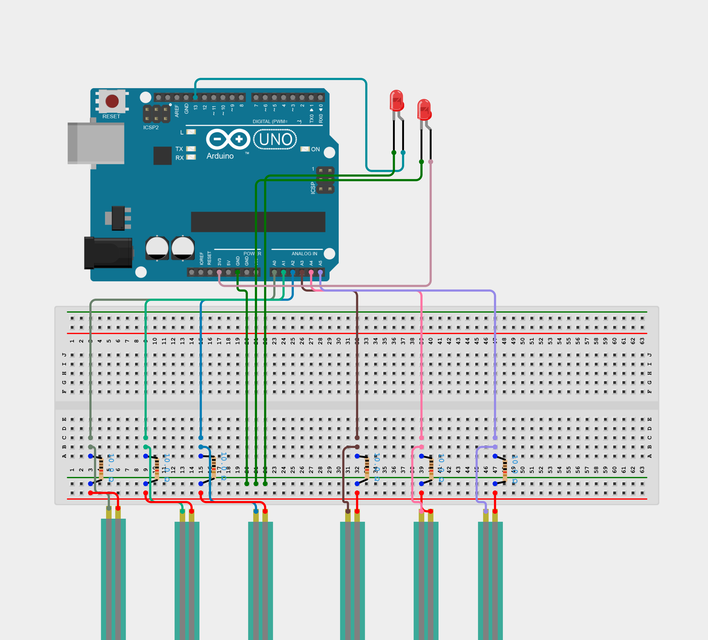

# pressure-pad-logger
A pressure pad residing under a mat, used for logging uptime of a machine.

:Author: kelly-macdonald

:Email: kelly.macdonald@formlabs.com

:Date: 6/30/2022 

:Revision: 01 

The goal of this project is to track the uptime of two machines by logging pressure on pressure-sensitive mats. Each of the two mats contains three force-sensitive resistors, all of which are connected to an Arduino MKR WiFi 1010. When pressure surpasses a threshold on any of the three resistors, the status of the mat is "TRUE". If all three resistors do not experience pressure surpassing the threshold, the status of the mat is "FALSE". When the status of either mat changes, a row is added to a Google Sheet with the name of the mat, the time of the change, and the new status. This information can be processed to report trends and totals related to machine use.

## Step 1: Set Up Arduino IoT Cloud Account
Follow this [link](https://login.arduino.cc/login?state=hKFo2SBsWGpkdk1wbGtYUVFzUXU4emJMUTFkMFN0MjZUamc1Y6FupWxvZ2luo3RpZNkgekZUSk1rUXBOQ1AtNUd3TzVDdnR0SDFNQ1hRem5aT3WjY2lk2SB1bUJ5Ulk4SXBZTVZrUHF3QVQ5UHZraU4yYWtVTnlJUw&client=umByRY8IpYMVkPqwAT9PvkiN2akUNyIS&protocol=oauth2&authorizeTimeoutInSeconds=5&scope=openid+profile+email&redirect_uri=https%3A%2F%2Fcreate.arduino.cc%2Fiot%2F&skipAutoLogin=true&domain=login.arduino.cc&cacheLocation=memory&response_type=code&response_mode=query&nonce=akhGM2VyNnlrRUg0TlU3fi1xTzlrRGNDY2xQZUNPMGdJQVBRcmwwVFZ2dw%3D%3D&code_challenge=gC6LZ4tZvY8S-EQ9pU9STDL-DSJj1C0tIyfKZYu_sJY&code_challenge_method=S256&auth0Client=eyJuYW1lIjoiYXV0aDAtc3BhLWpzIiwidmVyc2lvbiI6IjEuMTIuMSJ9#/sso/register) to create a free account. Create a new "thing" and configure an Arduino MKR WiFi 1010 via a USB cable. Configure network connection with the desired network. Create two variables called person_on1 and person_on2 within the "thing". Be sure that they are boolean variables with Read & Write permissions and that they update on change with a threshold of 0.

## Step 2: Verify code
In the sketch, paste the code from Pressure_Mat_may10a.ino. The other files will have update automatically based on the variable and network information provided in the main "thing" screen. Verify code.

## Step 3: Assemble circuit and mat
Assemble the circuit following the diagram pressure_mat_circuit.png found in this repository. Note that WiFi capability will be possible with an Arduino MKR WiFi 1010, although an Arduino UNO is depicted in the diagram.

## Step 4: Upload and test code
Plug in Arduino and upload code. To test, either monitor the variables' status from the "thing" page, or create a simple dashbord with LED indicators in the "Dashbords" page on Arduino IoT Cloud. To change the sensitivity of the pressure sensor, adjust the threshold variable in the Arduino code and reupload.

## Step 4: Set up WebHook Applet via IFTTT
In order to upload the variable updates to a Google sheet, set up an account with [IFTTT](https://ifttt.com/join). Create a new Applet using a Webhook as a trigger. Select the "receive web request" option, and use any name for the request. Connect the "then" property to Google Sheets and select add row to spreadsheet. Change the spreadsheet name to "MS Tracking Data Source" and filepath to wherever the file should exist in Google Drive. Under "My Services", go to "Webhooks" and then "Settings". Copy the URL. In the Arduino IoT Cloud "Things" page, select "Connect Webhook" at the bottom of the page and paste the URL. At this point, any change in status of the mats should trigger a new row in a Google Sheet in the Drive selected in IFTTT.

## Step 5: Process data in Google Sheets
Create a second Google Sheet called "MS Tracking Data Archive". This is necessary because IFTTT will generate new sheets after surpassing 2000 rows in the Source file. Name the first sheet on each of the files "Raw Data". Now, create a script that copies any data from the source file into the archive file Under "Extensions" on the "MS Tracking Data Source" file, open Apps Script. Copy the onChange function, which can be found in the repository, into the script window. In the "Triggers" tab, add a new trigger. Select "onChange" for "Choose which function to run", "Head" for "Which runs at deployment", "From spreadsheet" for "Select event source", and "On change" for "Select event type". Test the cody by typing into cells on the source file. They should disappear and be found on the next empty rows in the archive file. The remainder of the data processing can be done in Google Sheets. Broadly, the data is first copied to the second sheet excluding any blank rows. Then, the amount of time between readings is calculated to check if it surpasses the time threshold (which can be edited on the "USAGE REPORT" page. The date of the reading is compared to the current day to generate running totals for the day, week, month, and of all time.

## BOM

| Part name | Part number | Quantity
| 10k Resistor                      | CFR-25JR-52-10K | 6       
| LED                               | 2460-L513SRD-ND | 2        
| Force Sens Resistor               | 1027-1033-ND    | 6        
| Arduino MKR WiFi 1010             | 1050-1162-ND    | 1     
| Moisture-Resistant Polyester Film | 8567K12         | 1
| Neodymium Magnet                  | 5862K102        | 8
| 3D printed case, breadboard, wires|
